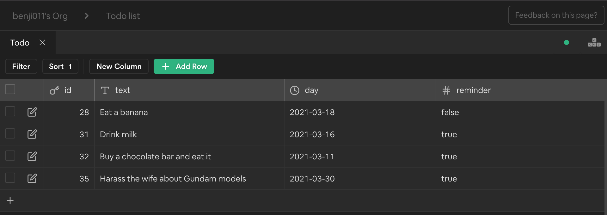

# React TODO web app

A POC Todo web app built with ReactJS in TypeScript, styled with Bulma & uses [Supabase](https://github.com/supabase/supabase) as it's backend API on production deployed on [Vercel](https://react-todo-benjaminlo.vercel.app/)

This app uses 2 different backends depending on the environment you run it on.

- In the case of production the app consumes resources from the Supabase API, which returns records from the Todo list table as JSON
  <a align="center">
  
  </a>

- In the case of development/local it uses [json-server](https://github.com/typicode/json-server) as a mock API backend.

## How to run

Clone from the `local` branch

```bash
git clone git@github.com:benji011/react-todo.git
```

Install dependencies then start the app in one terminal..

```bash
yarn && yarn start
```

While the local server is running open another terminal and start the db service

```bash
yarn start:db
```

Access http://localhost:3000 in your browser

<a align="center">

</a>
