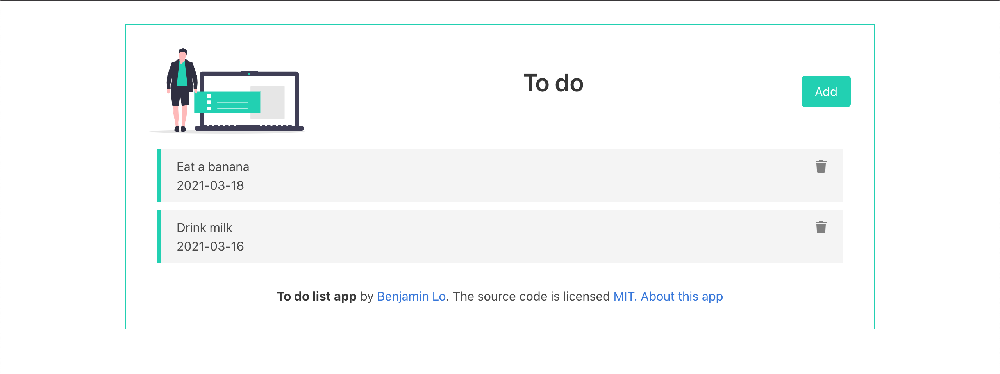

# React TODO web app

<a align="center">

</a>

A simple todo web app built with ReactJS in TypeScript, styled with Bulma & uses Supabase as it's backend API on production deployed on [Vercel](https://react-todo-benjaminlo.vercel.app/)

## Usage

```bash
yarn && yarn start
```

## Running the mock backend

The local API is just a simple [json-server](https://github.com/typicode/json-server) that mimics what data you can expect to work with.

```bash
yarn start:db
```
